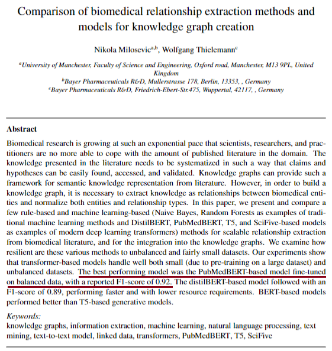
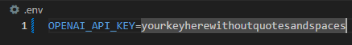

# RAG-Document-Custom-Chatbot
Description:
This project implements a Retrieval-Augmented Generation (RAG) chatbot that enables context-aware question answering based on documents like PDFs or text files. The chatbot uses a combination of vector embeddings (via FAISS) and large language models (LLMs) such as GPT-3.5 to retrieve relevant information from the documents and provide accurate, context-driven responses.

# Example
The model will provide responses based on the information contained in the document "document_sample.pdf" for this case.

Abstract:

Key features include:

Document Parsing: Supports PDF and text file ingestion.
Vector Search: Efficient retrieval using FAISS for similarity search.
Custom Prompts: Tailored prompts for accurate and concise answers.
Explainable AI: Tracks and cites document sources for transparency.
Extensible Design: Easily adaptable for different use cases and document types.

# Please note - provide your OpenAI key on the .env file

